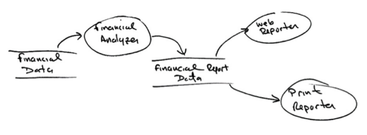

# Contexto de la problemática

Tenemos un sistema que muestra información financiera en una página web.
Nuestros clientes nos han solicitado que esta información sea generada como un reporte de texto.
La aplicación utiliza etiquetas de HTML para darle formato al reporte Web, sin embargo el reporte impreso deberá usar saltos de línea \n, tabuladores \t y espaciado para dar formato al reporte final.
Los números negativos se muestran en rojo en el formato HTML mientras que en el formato impreso deberán mostrarse entre paréntesis.
El proyecto actual no cuenta con ninguna buena práctica o principio de programación. Tampoco cuenta con ningún patrón de diseño.

La siguiente imagen muestra una buena separación de responsabilidades para generar el reporte Impreso y Web, puedes basarte en él para refactorizar nuestro proyecto.

# Objetivo

El objetivo del proyecto es la refactorización del código actual (Edición de código sin alterar su funcionalidad) de tal manera que el resultado final del código:

* Genera el archivo `PrintReport.java` cumpliendo  las especificaciones mencionadas en contexto de la problematica. 
  * TIP: Al generar el archivo te recomiendo refactorizar tambien la clase `WebReport.java` utilizando algún patron de diseño.
* Utilice al menos 4 patrones de diseño.
* Identifica todos los principios de SOLID dentro de tu aplicacion.